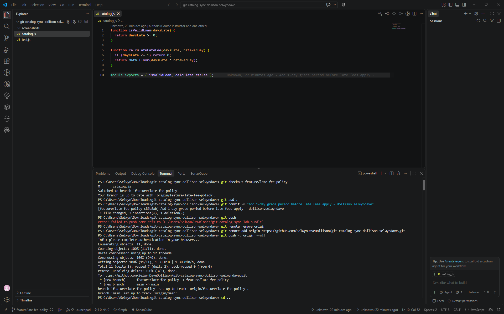
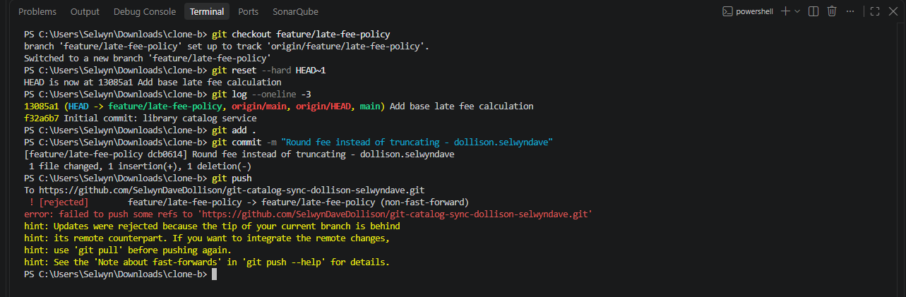
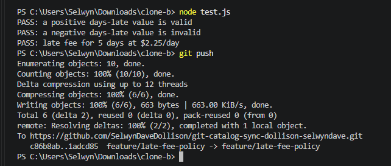
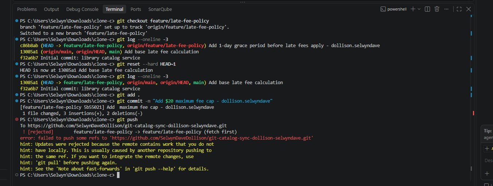
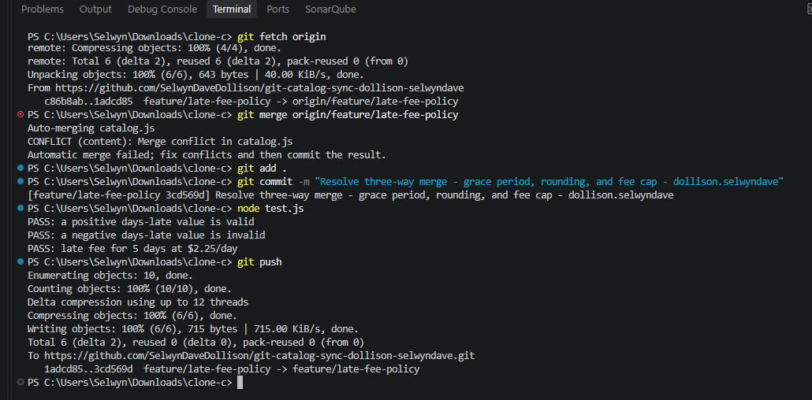
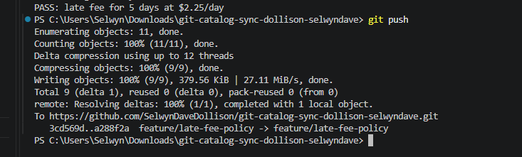
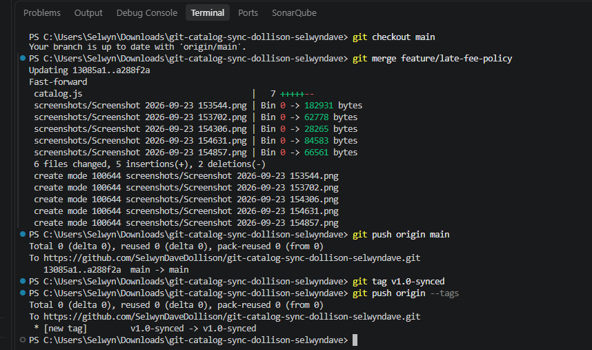

# WORKFLOW.md

## Task 1


## Task 2


## Task 3


## Task 4


## Task 5


## Task 6


## Task 7


## Questions

### 1. Walk through the final `calculateLateFee` function and name which contributor's change is responsible for each part.

​```javascript
function calculateLateFee(daysLate, ratePerDay) {
  if (daysLate <= 1) return 0;              // Grace period — Contributor A (Task 1)
  let fee = Math.round(daysLate * ratePerDay); // Rounding — Contributor B (Task 2)
  fee = Math.min(fee, 20);                   // $20 max cap — Contributor C (Task 4)
  return Math.max(fee, 1);                   // $1 min fee — Contributor A (Task 6)
}
​```

- The grace period check (`daysLate <= 1 return 0`) came from Clone A's Task 1 commit.
- The switch from `Math.floor` to `Math.round` came from Clone B's Task 2 commit.
- The `Math.min(fee, 20)` cap came from Clone C's Task 4 commit.
- The `Math.max(fee, 1)` minimum came from Clone A's Task 6 commit (rebased in last).

### 2. Compare Task 3's two-way conflict to Task 5's three-way conflict — what got harder with a third line of work?

In Task 3, there were only two competing versions of `calculateLateFee` to reconcile (grace period vs. rounding), so I only had to decide how to combine two behaviors into one function. In Task 5, the merge conflict included three concurrent changes at once — the already-merged grace period + rounding logic (from Clone B's earlier push) alongside Clone C's brand new $20 cap. This meant I had to read and understand three interacting requirements simultaneously instead of two, and make sure the order of operations (grace period first, then rounding, then capping) didn't accidentally cancel out or override one of the earlier behaviors. It also required trusting that the already-resolved two-way merge was correct before adding a third layer on top of it.

### 3. What's the actual difference between how you resolved Task 5 (merge) and Task 6 (rebase)?

The Task 5 merge created a new "merge commit" that combined Clone C's history with the already-merged mainline history from origin — the commit history keeps both parallel paths visible, joined together by one merge commit. The Task 6 rebase instead rewrote Clone A's commit so that it appeared to be built directly on top of the latest origin history, producing a single linear commit history with no merge commit at all. Functionally, both approaches resolved the same kind of conflict (competing versions of `calculateLateFee`), but rebase changes the actual commit hash and position of Clone A's work, while merge preserves the original commits and adds a new one on top.

### 4. If this were a real team of three, what one process change would have prevented all three rejected pushes?

Requiring each contributor to run `git fetch` and `git pull --rebase` (or at least `git fetch` and review the remote branch) before starting any local work would have prevented all three rejections. Since each rejected push happened because a contributor started editing from a branch state that was already out of date, a simple team norm — always sync with the remote before making changes, not just before pushing — would have surfaced the divergence earlier and let each contributor resolve conflicts as they went instead of discovering a rejected push after already committing.